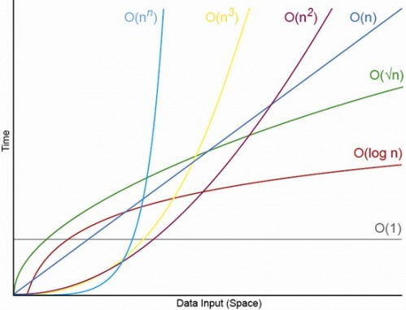

# Push Swap

I have decided to use a singly linked list to practice them for the exam.  
I learnt about them for the first time in Libft Bonus.

<!-- Comments are like html -->
<h2>Contents</h2>
<ul>
  <li>Things to study before starting</li>
	<ul>
  		<li><a href="#linked-list">Linked List Notation</a></li>
		<li><a href="#big-o-notation">Understanding Big O Notation</a></li>
		<li><a href="#sort-algo">Some sorting algorithms</a></li>
	</ul>
  <li>Building the project</li>
	<ul>
  		<li><a href="#make">Makefile</a></li><!-- To write -->
  		<li><a href="#moves">Operation moves</a></li>
		<li><a href="#error">Error Handling</a></li>
		<li><a href="#parsing">Parsing</a></li><!-- To write -->
		<li><a href="#free">Printing Error and Freeing both stacks</a></li><!-- To write -->
		<li><a href="#stack">Creating the stack</a></li><!-- To write -->
		<li><a href="#sort-small">Sorting small</a></li>
		<li><a href="#sort-large">Sorting large</a></li><!-- To write -->
		<li><a href="#test-cases">Test cases</a></li><!-- To write -->
	</ul>
	<li><a href="#mistake">My mistakes lol</a></li>
</ul>

## Things to study before starting

<h3 id="linked-list">Linked List Notation</h3>

`stack.a` is used to access a variable when stack is not a pointer <br>
eg:
`stack.a->value = 42;`
`stack.a->next = NULL;`

`stack->a` is a pointer to the struct `t_stack *`.  
`stack->a` is the same as `(*stack).a`.  
`&stack->a` is the address of the pointer to the stack a.

#### Summary Table

| Expression      | Meaning / Points To                        | Type        | Usage Context           | Example Usage                  |
|----------------|---------------------------------------------|-------------|--------------------------|--------------------------------|
| `t_stack stack`| Declares a stack struct variable            | `t_stack`   | Declaration              | `t_stack stack;`              |
| `t_stack *s`   | Pointer to a stack struct                   | `t_stack *` | Declaration              | `t_stack *s = malloc(...);`   |
| `*stack->a`    | Dereference: the actual node `a` points to  | `t_node`    | In function body         | `int x = (*stack->a).value;`  |
| `stack.a`      | Member `a` from struct                      | `t_node *`  | In function body         | `stack.a = new_node(42);`     |
| `stack->a`     | Member `a` from pointer to `t_stack`        | `t_node *`  | In function body         | `stack->a = new_node(42);`    |
| `&stack`       | Address of the stack                        | `t_stack *` | Passed as parameter      | `sort_three(&stack);`         |
| `&stack.a`     | Address of `a` from struct                  | `t_node **` | Passed as parameter      | `swap(&stack.a);`             |
| `&stack->a`    | Address of `a` from pointer to struct       | `t_node **` | Passed as parameter      | `swap(&stack->a);`            |

#### Visual Diagram

stack_ptr ──▶ [t_stack]<br>
&nbsp;&nbsp;&nbsp;&nbsp;&nbsp;&nbsp;&nbsp;&nbsp;&nbsp;&nbsp;&nbsp;&nbsp;&nbsp;&nbsp;&nbsp;&nbsp;&nbsp;&nbsp;&nbsp;&nbsp;&nbsp;&nbsp;&nbsp;&nbsp;├─ a ───▶ [t_node: value=37]<br>
&nbsp;&nbsp;&nbsp;&nbsp;&nbsp;&nbsp;&nbsp;&nbsp;&nbsp;&nbsp;&nbsp;&nbsp;&nbsp;&nbsp;&nbsp;&nbsp;&nbsp;&nbsp;&nbsp;&nbsp;&nbsp;&nbsp;&nbsp;&nbsp;│&nbsp;&nbsp;│<br>
&nbsp;&nbsp;&nbsp;&nbsp;&nbsp;&nbsp;&nbsp;&nbsp;&nbsp;&nbsp;&nbsp;&nbsp;&nbsp;&nbsp;&nbsp;&nbsp;&nbsp;&nbsp;&nbsp;&nbsp;&nbsp;&nbsp;&nbsp;&nbsp;│&nbsp;&nbsp;└─▶ [t_node: value=7]<br>
&nbsp;&nbsp;&nbsp;&nbsp;&nbsp;&nbsp;&nbsp;&nbsp;&nbsp;&nbsp;&nbsp;&nbsp;&nbsp;&nbsp;&nbsp;&nbsp;&nbsp;&nbsp;&nbsp;&nbsp;&nbsp;&nbsp;&nbsp;&nbsp;│&nbsp;&nbsp;&nbsp;&nbsp;│<br>
&nbsp;&nbsp;&nbsp;&nbsp;&nbsp;&nbsp;&nbsp;&nbsp;&nbsp;&nbsp;&nbsp;&nbsp;&nbsp;&nbsp;&nbsp;&nbsp;&nbsp;&nbsp;&nbsp;&nbsp;&nbsp;&nbsp;&nbsp;&nbsp;│&nbsp;&nbsp;&nbsp;&nbsp;└─▶ NULL<br>
&nbsp;&nbsp;&nbsp;&nbsp;&nbsp;&nbsp;&nbsp;&nbsp;&nbsp;&nbsp;&nbsp;&nbsp;&nbsp;&nbsp;&nbsp;&nbsp;&nbsp;&nbsp;&nbsp;&nbsp;&nbsp;&nbsp;&nbsp;&nbsp;├─ b ───▶ NULL<br>
&nbsp;&nbsp;&nbsp;&nbsp;&nbsp;&nbsp;&nbsp;&nbsp;&nbsp;&nbsp;&nbsp;&nbsp;&nbsp;&nbsp;&nbsp;&nbsp;&nbsp;&nbsp;&nbsp;&nbsp;&nbsp;&nbsp;&nbsp;&nbsp;└─ move_count = 0<br>

<br>
We need to pass the address into a function in order to modify what nodes they are going to point to for the functions: swap, push, rotate and reverse rotate.

so the prototype for swap would be as such:

<pre lang="c">static void	swap(t_node **head);</pre>

In which, we want to modify the contents of the node, this explains its data type. The argument passed in is the double pointer, with the name "head".

Same with passing with reference, in which it will modify the value in the int/char. We want to modify the address of the pointer. Hence, we need to pass a double pointer.

<h3 id="big-o-notation">Understanding Big Notation - Time and space complexity</h3>



O(n): Linear time

<h3 id="sort-algo">Sorting algorithms</h3>


<br>There are others that I haven't fully studied too, like DSA - Data Structure Algorithms, Greedy Algorithms, Divide and Conquer, Brute Force, et cetera...

## Building the Project

<h3 id="make">Makefile</h3>

I thought of throwing all the code from Milestone 0 and 1 into a complete Libft. Yeah, then I can throw it into some project that can use the code I have coded before... <br>
The file structure within Libft should be as such:<br>

libft/<br>
├── *.c<br>
├── libft.h<br>
├── Makefile&nbsp;← main Makefile<br>
├── get_next_line/<br>
│&nbsp;&nbsp;&nbsp;&nbsp;├── *.c<br>
│&nbsp;&nbsp;&nbsp;&nbsp;├── get_next_line.h<br>
│&nbsp;&nbsp;&nbsp;&nbsp;└── Makefile<br>
└── ft_printf/<br>
&nbsp;&nbsp;&nbsp;&nbsp;&nbsp;├── *.c<br>
&nbsp;&nbsp;&nbsp;&nbsp;&nbsp;├── ft_printf.h<br>
&nbsp;&nbsp;&nbsp;&nbsp;&nbsp;└── Makefile<br>

#### The plan
As you can see, I have a total of three makefiles within the entire structure.<br>
First, I needed to modify the ft_printf makefile. <br>
Because it was once the outer makefile and I did not use any functions from the original libft. <br>
Removed the parts where it goes into a folder called libft to make the `libft.a` and `cp` it out to compile with libftprintf.a.<br>
Change it to make regularly...<br>
The makefile here will make `ft_printf.a` within the ft_printf/ folder.<br>

And then for get_next_line, there was no makefile so make one...<br>
The makefile here will make `get_next_line.a` within the get_next_line/ folder. `all` and `bonus` are all archived together because I saw no reason to not...<br>

And then for the libft makefile...
1. I need to include the directories to find `ft_printf.a` and `get_next_line.a`
2. need to ar x `ft_printf.a` and `get_next_line.a` to get the .o
files (this is to link them, so I can use the functions)
3. Just note when you cc -c (this flag actually doesn't do the linking, so there's no a.out file, also because there is no int main to compile with)
4. And then, I needed to fix the `make clean` and `make fclean` because the .o files from gnl and ft_printf were not being removed.<br> To do that, I made two variables for the .o files that were `ar x` and then added them to the `ar rcs` and `clean` and `fclean` sections
5. Also, don't forget to add, eg: `make -C $VAR clean` and `make -C $VAR fclean`to clean up within the directories (-C flag basically means to change directory)
6. I needed to update the libft.h with the `ft_printf()` and `get_next_line()` as well.
7. Remember to not write any wildcards, eg: (*.c, ?, ... )

#### Errors Encountered

Bruh, I spent three days trying to fix this makefile business gg...

1. I have a libft `ft_strlen()` in ft_strlen.c and a ft_printf `ft_strlen()` in ft_puts.c because I changed the utilities to suit the needs of the ft_printf project. Libft was using `size_t` while ft_printf was using `int`, if I am not wrong.
So, going forward, if there's a need to use `ft_strlen()`, name it differently(?) or just write it into the function itself (?)

2. AM still confused...<br>
For this: <br>
`CFLAGS = -Wall -Wextra -Werror -I$(GNLDIR) -I$(FT_P_DIR)`


| Term    | What it means                            | Why it's used                |
| ------- | ---------------------------------------- | ---------------------------- |
| `-fPIC` | Compiles relocatable code                | Needed for shared libs / PIE |
| PIE     | Executable using PIC                     | Enables ASLR, safer programs |
| ASLR    | OS feature that randomizes memory layout | Prevents exploits            |

#### 🔹 -fPIC: Position-Independent Code

What it does:
Compiles code so it can be loaded at any memory address.

Why it's useful:

    Required for shared libraries (.so)

    Avoids hardcoding memory addresses in compiled code

    Helps with security features like ASLR (see below)

#### PIC = Position Independent Code
🔹 PIE: Position-Independent Executable

What it does:
Creates an executable that, like a shared library, can be loaded at any memory address.

Why it's used:

    Works with ASLR (Address Space Layout Randomization)

    Makes your program harder to exploit

    PIE builds on PIC — you can think of PIE as a full executable version of PIC.

Most modern OSes (like Linux) compile all binaries as PIE by default.
#### 🔐 ASLR: Address Space Layout Randomization

What it does:
Randomizes where your code, stack, heap, and libraries are loaded in memory.

Why it matters:

    Prevents attackers from knowing where your code lives

    Makes buffer overflows and return-to-libc attacks much harder

    Without ASLR, attackers can predict memory addresses easily
    With ASLR + PIE, memory layout changes every time the program runs

<h3 id="moves"> 1. Operation Moves</h3>
- Swap<br>
	Firstly, always check if there are two nodes to execute the swap<br>
- Push<br>
	Check if there is a node to perform the push in the stack<br>
- Rotate<br>
	Firstly, always check if there are two nodes to execute the rotate<br>
- Reverse Rotate<br>
	Firstly, always check if there are two nodes to execute the reverse rotate<br>

<h3 id="error"> 2. Error Handling</h3>

Firstly, you need to understand the behaviour of the shells when taking in arguments.<br>
A good example would be the comparision within the bash(what I use at home) and zshell(what I use in 42). (Well, there's also the fish shell in 42, but I have not use it.)<br>
For example, if I enter this as the argument in both shells:<br>
```./push_swap 4 5 6```<br>
The argument count will be 4 for both. However, if I use this:<br>
```./push_swap "4 5 6"```<br>
This will be regarded as 4 arguments in bash, but in zshell, it is 2 arguments.
So, the code must be able to handle taking in the arguments regardless of the argument count. So, we will use `ft_split` to split the args.

Test cases are split into those that will output nothing, those that will output an error and those that will output the operation moves. These are some examples:<br>

#### **No** output:
- **Only argv[0]**<br>
	`./push_swap`<br>
- **One number in argv[1]**<br>
	`./push_swap 42`<br>
	`./push_swap "42"`<br>
- List **already sorted**<br>
	`./push_swap 4 5 6`<br>
	`./push_swap "4 5 6"`<br>
#### **Error** output:
- **Empty string**<br>
	`./push_swap ""`<br>
	`./push_swap "" 5`<br>
	`./push_swap "" 5 -110`<br>
	`./push_swap 5 "" -110`<br>
- **Duplicates** in argument<br>
	`./push_swap 2 2 3 4`<br>
	`./push_swap "2 2 3 4"`<br>
- **Anything except numbers** in argument<br>
	`./push_swap A -3 4`<br>
	`./push_swap "A -3 4"`<br>
- **Decimals** in argument<br>
	`./push_swap 2 0.3 4`<br>
	`./push_swap "2 0.3 4"`<br>
- **Single quotes** instead of double quotes<br>
	`./push_swap '2 3 4 -2'`<br>
- **More than two signs** in a row<br>
	`./push_swap "2 3 4 +-2"`<br>
	`./push_swap "2 3 --4 -+2"`<br>
- **Addition or subtraction**<br>
	`./push_swap "-1 + 2"`<br>
	`./push_swap "21 - 3"`<br>
- **More than** INT MAX or **Less than** INT MIN<br>
	`./push_swap 2 3 -2147483649`<br>
	`./push_swap "2 3 2147483648"`<br>
#### Operation Moves output:
- **Extra spaces** at back or front within argv[1 and beyond]<br>
	`./push_swap "2 3    5      -10"`<br>
- **Spaces in front or back** within argv[1 and beyond]<br>
	`./push_swap "      2 3    5      -10"`<br>
- **With one space** at back or front within argv[1 and beyond]<br>
	`./push_swap "2 3 5 -10 "`<br>
- **Without space at end of double quotes**<br>
	`./push_swap "2 3 5 -10"`<br>
- **Negative Numbers**<br>
	`./push_swap "2 3 -5 -10"`<br>
- **Plus sign**<br>
	`./push_swap "2 3 -5 +10"`<br>
- INT MAX or INT MIN<br>
	`./push_swap 2 -2147483648 -10`<br>
	`./push_swap 2 2147483647 -10`<br>
- Test cases within **more than one set of Double quotes**<br>
	`./push_swap "2 3 -10 -5" "6 -7 -53"`<br>
	`./push_swap "string" "string"`<br>
- Another funny test case<br>
	`./push_swap "  2 3 -5 10 " 0 4 "15 -43"`<br>
	`./push_swap "string" args args "string"`<br>
- Another funny test case Part 2<br>
	`./push_swap 4"" -54`<br>
	`./push_swap 4 ""-54`<br>
	`./push_swap args"empty string" args`<br>

#### Count the number of operations executed by program
This is the binary code that 42 wants you to test with:<br>
`ARGS="$(cat output.txt)"; ./push_swap $ARGS`<br>
just add `| wc -l` to count the lines
`ARGS="$(cat output.txt)"; ./push_swap $ARGS | wc -l`<br>

#### What you cannot do with the binary:
`ARGS=4"" 5; ./push_swap $ARGS`<br>

#### To generate sorted numbers for testing
`seq -40 100 | shuf | head -n 100 | xargs > output.txt`<br>
And then, run it with this: <br>
`ARGS="$(cat output.txt)"; ./push_swap $ARGS`<br>

#### To generate random numbers (both negative and positive)
Use this shell command (example): <br>
`seq -100 100 | shuf | head -n 100 | xargs > output.txt`<br>
seq "the range (can be very big, but -100000000 1000000000 takes a long time to generate so... didn't try *INT MIN* and *INT MAX*)" | shuf "randomize" | head -n 100 (get the first 100 numbers) | xargs(write the numbers into a single line) > put the result into output.txt <br>
And then, run it with this: <br>
`ARGS="$(cat output.txt)"; ./push_swap $ARGS`<br>

Alternatively, you can use this link: <br>
[Random Number Generator (negative and positive)](https://appzaza.com/random-number-generator)


<h3 id="parsing">Parsing the arguments</h3>
- check if each line of the 2d array is a number
- check and convert ascii to long (if <INT_MIN && >INT_MAX, return error)
- check for duplicates within the linked list
- create the node to put the value into
- free split [i] after

<h3 id="sort-small">Sort Small</h3>

#### Sort two
Sort two can be executed using either sa() or ra(), pick either.

#### Sort three

I did the comparision of the **values** from left to right:  
So, starting with sa:
&nbsp;&nbsp;&nbsp;&nbsp;Compare x and y -> x > y<br>
&nbsp;&nbsp;&nbsp;&nbsp;Compare x and z -> x < z<br>
&nbsp;&nbsp;&nbsp;&nbsp;Compare y and z -> y < z<br>

Same for the other permutations, but I wrote it out to visualise:

|Moves |OK|sa|rra|ra|sa ra|sa rra|
|:---:|:---:|:---:|:---:|:---:|:---:|:---:|
|x|4|5|5|6|4|6|
|y|5|4|6|4|6|5|
|z|6|6|4|5|5|4|

and then compare it to another set of numbers to see if the algorithm is right:

|Moves |OK|sa|rra|ra|sa ra|sa rra|
|:---:|:---:|:---:|:---:|:---:|:---:|:---:|
|x|-3|0|0|3|-3|3|
|y|0|-3|3|-3|3|0|
|z|3|3|-3|0|0|-3|

Yeah, kinda looks right.

#### Sort Five

Where's `sort_four()`?<br>
At the bottom of this... It's easier to explain this first then go on to sort four...<br>

I rely on the assigning of **indexes**. Then, find the smallest two indexes to push over to b.<br>
If the number on top of stack b is smaller than the one at the bottom, swap b.<br>Because we need to push them back
so that they are in ascending order, with the smallest on top.<br>
eg:
|a |b|
|:---:|:---:|
|4|-3|
|9|-2|
|20||

-3 is smaller than -2, so swap b and then push them all back to stack a.

Swap b:
|a |b|
|:---:|:---:|
|4|-2|
|9|-3|
|20||

so that the outcome becomes this:

|a |b|
|:---:|:---:|
|-3||
|-2||
|4||
|9||
|20||

#### Sort Four

Initially, I thought that writing `sort_five()` was good enough to also cover for Sort Four but nope...<br>
That's because in my code, I am using the indexes. <br>
So, here is an example of why it didn't work: <br>
`ARGS="1 5 3 -10"; ./push_swap $ARGS`<br>
<br>
|`sort_four` |`sort_five`|
|:---:|:---:|
|pb|ra|
|sa|ra|
|rra|ra|
|pa|pb|
||sa|
||ra|
||pa|

Output:
|`sort_four` |`sort_five`|
|:---:|:---:|
|1|-10|
|-10|1|
|3|3|
|5|5|

In `sort_five()`, both indexes [1] OR [0] can be pushed over.<br>
In this example, index[1] was pushed to stack B and pushed back onto stack A without being sorted.<br>
So, to make sure the correct index was pushed over (index[0] only), I needed to code the sort_four.<br>
